# Ask a Question Architecture and Strategy

This document describes the `Ask a Question` capability added to the NLM Cell Knowledge Network UI. It is written for developers, graph curators, and technical stakeholders who need to understand how free-text biomedical questions become ArangoDB traversals, tables, graph visualizations, and follow-up exploration workflows.

The feature lives across a React chat/graph interface and a Django service layer that generates, validates, executes, and normalizes read-only AQL over the CKN ArangoDB graphs.

## Goals

The `Ask a Question` page is designed to let a user ask ordinary biomedical questions such as:

- `what genes are associated with asthma?`
- `what cells are associated with alzheimers?`
- `what clinical trials are available for alzheimers disease?`
- `show cell sets reachable from retina`
- `can you show me drugs associated with this?`

The system should:

1. Convert natural language into read-only AQL.
2. Use the CKN schema and live Arango graph structure to choose collections and hops.
3. Prefer deterministic, schema-aware traversals for common CKN questions.
4. Use OpenAI as a fallback generator when deterministic plans do not cover the question.
5. Return both tabular rows and graph-shaped context.
6. Preserve source nodes and edges so the graph explains why a result was returned.
7. Support follow-up questions that refine or expand the current graph.
8. Suggest next questions only when they are likely to add reachable data.
9. Let users inspect, prune, expand, save, and export result graphs.

## Main Files

Frontend:

- `react/src/pages/AskQuestionPage/AskQuestionPage.js`
- `react/src/styles/pages.css`
- `react/src/services/api/aql.js`
- `react/src/constants/api.js`
- `react/src/store/savedGraphsSlice.js`

Backend:

- `arango_api/services/question_service.py`
- `arango_api/serializers.py`
- `arango_api/views.py`
- `arango_api/urls.py`
- `core/settings.py`

## Request Flow

At a high level, the flow is:

```mermaid
flowchart LR
  A["User asks a question"] --> B["React Ask page"]
  B --> C["POST /arango_api/ask/"]
  C --> D["question_service.answer_question"]
  D --> E{"Refine mode?"}
  E -->|yes| F["Generate follow-up plan from result history"]
  E -->|no| G["Generate deterministic traversal plan"]
  F --> H{"Plan found?"}
  G --> H
  H -->|no| I["OpenAI AQL generation if configured"]
  H -->|yes| J["Validate read-only AQL"]
  I --> J
  J --> K["Execute against selected Arango graph"]
  K --> L["Recover if no rows or AQL fails"]
  L --> M["Extract rows, nodes, links"]
  M --> N["Generate suggested next questions"]
  N --> O["React renders table and graph"]
```



## Frontend Architecture

### Ask Page State

`AskQuestionPage.js` manages the full interactive workflow:

- `question`: current input text.
- `graph`: selected backend graph, currently `ontologies` or `phenotypes`.
- `messages`: chat transcript containing user and assistant messages.
- `activeResultIndex`: which assistant result is currently displayed.
- `viewMode`: `table` or `graph`.
- `queryMode`: `new` or `refine`.
- `isGraphExpanded`: whether the graph viewer is in expanded mode.
- `isGraphSelectMode`: whether region selection is active.
- `selectedGraphNodeIds`: nodes selected by box select.
- `nodeSuggestions`: selected-node suggestions and enrichment status.
- `saveGraphName`, `saveGraphMessage`, `saveGraphDownload`: graph save/export UI state.

### New Search vs Refine

The UI has two modes:

- `New search`: ignore prior graph context and ask a fresh question.
- `Refine current graph`: send summarized prior result context to the backend.

After a result with graph nodes is returned, the default behavior becomes `refine`, so pressing `Enter` asks a follow-up against the visible graph. Users can still explicitly click `New search`.

The frontend summarizes prior results with `summarizeResultForHistory(result)`, sending compact node, edge, AQL, and result metadata rather than the entire result payload.

### Result Rendering

Each assistant response can contain:

- `answer`: a human-readable explanation.
- `aql`: generated or recovered AQL.
- `bind_vars`: bind variables.
- `columns`: table columns.
- `rows`: raw result rows.
- `nodes`: normalized graph nodes.
- `links`: normalized graph edges.
- `suggested_questions`: result-level follow-up question chips.

The Results panel can show:

- A table view that hides internal identifier columns where possible.
- A graph view with a D3 force layout.
- Generated AQL with recovery/expansion/pruning notes.

### Graph Viewer Controls

The graph viewer provides:

- `Home`: fit all visible nodes into the canvas.
- `Select`: freeze the current view and enable region selection.
- `Delete selected`: remove selected nodes from the visualization context.
- `Delete singlets`: remove nodes with no visible links.
- Save icon: save the current graph to the app's saved graph store and prepare a loader-compatible JSON download.
- `Expand graph`: show the graph in a resizable expanded shell.

### Graph Pruning

Deletes are visualization/context deletes, not database deletes.

When nodes are removed:

1. The node is removed from `result.nodes`.
2. Connected visible links are removed from `result.links`.
3. Rows containing that node ID are filtered out.
4. AQL is wrapped with an exclusion filter through `withPrunedAql`.
5. `graph_context_pruned` metadata is added.

This keeps the current graph state consistent with what the user sees.

### Node Click Suggestions

Clicking a graph node triggers a two-stage suggestion strategy:

1. Immediate local suggestions from currently visible incident links.
2. Backend enrichment via `/arango_api/ask/node-suggestions/`.

The local suggestions appear fast even if the backend takes longer. The backend enrichment is cached per `graph:nodeId`.

Node suggestions appear in the left Ask panel as chips, not inside the graph canvas, preserving graph real estate.

### Save and Export

The save icon does two related things:

1. Saves a graph object into the existing `savedGraphs` Redux slice, compatible with the app's saved graph history.
2. Generates a downloadable graph file in the existing loader-compatible format:

```json
{
  "nodes": [],
  "links": []
}
```

The internal saved graph entry includes name, timestamp, settings, origin node IDs, graph data, source question, answer, and AQL. The downloaded file intentionally uses only top-level `nodes` and `links` because the existing load-from-file function validates that shape.

## Backend Architecture

### API Endpoints

`arango_api/urls.py` exposes:

- `POST /arango_api/ask/`
- `POST /arango_api/ask/node-suggestions/`

`QuestionAnswerView` validates input with `QuestionRequestSerializer` and calls:

```python
question_service.answer_question(question, graph, mode, history)
```

`NodeSuggestionsView` validates `node_id` and calls:

```python
question_service.suggest_questions_for_node(node_id, graph)
```

### Input Schema

`QuestionRequestSerializer` accepts:

- `question`: natural language question.
- `graph`: `ontologies` or `phenotypes`.
- `mode`: `new` or `refine`.
- `history`: recent conversation/result summary list.

`NodeSuggestionRequestSerializer` accepts:

- `graph`
- `node_id`

### Main Answer Pipeline

The central function is:

```python
answer_question(question, graph="ontologies", history=None, mode="new")
```

It performs:

1. Build live schema context from Arango.
2. Try a follow-up/refine plan if mode is `refine`.
3. Try deterministic traversal plans.
4. Try explicit deterministic collection label search.
5. Use OpenAI if configured.
6. Fall back to broad schema-aware text search if OpenAI is unavailable.
7. Normalize and validate read-only AQL.
8. Execute AQL.
9. Recover with deterministic traversal if execution fails or returns no rows.
10. Extract graph nodes and links.
11. Optionally re-run a richer context traversal if the first answer lacks graph relationship context.
12. Generate suggested next questions.

### Safety Strategy

Generated AQL is normalized and validated before execution:

- Trailing semicolons are removed.
- AQL is checked with `AQLQuerySerializer`.
- Mutating statements are forbidden.
- System collections are blocked.
- The OpenAI prompt explicitly asks for read-only AQL only.

The service does not execute arbitrary user-provided AQL through the Ask endpoint. It generates plans, validates them, and runs only read-only queries.

## Schema and Collection Model

The backend has a LinkML-informed concept map in `CKN_SCHEMA_CONCEPTS`:

| Concept | Collection | Meaning |
| --- | --- | --- |
| CellType | `CL` | Cell type ontology terms |
| CellSet | `CS` | Sets or clusters of cells from datasets |
| CellSetDataset | `CSD` | Single-cell datasets |
| Gene | `GS` | Genes and gene symbols |
| Disease | `MONDO` | Diseases and conditions |
| Drug | `CHEMBL` | Drugs and compounds |
| Protein | `PR` | Proteins |
| AnatomicalStructure | `UBERON` | Anatomy, organs, tissues |
| BiologicalProcess | `GO` | GO biological processes |
| ClinicalTrial | `NCT` | Clinical trials |
| Publication | `PUB` | Publications |
| Phenotype | `HP` | Human phenotypes |
| Taxon | `NCBITaxon` | Species and taxa |
| PhenotypicQuality | `PATO` | Phenotypic qualities |
| ChemicalEntity | `CHEBI` | Chemical entities |
| HumanDevelopmentStage | `HsapDv` | Development stages |
| BiomarkerCombination | `BMC` | Biomarker combinations |
| BinaryGeneSet | `BGS` | Binary gene sets |

The service also builds live schema context from Arango:

- Loaded collections.
- Sampled fields.
- Collection counts.
- Named graph edge definitions.
- Association hints.

This live schema context is included in the OpenAI prompt and also used by deterministic fallback logic.

## Deterministic Planning

The backend prefers deterministic AQL when it recognizes the question pattern. This keeps common CKN workflows stable and avoids unnecessary model calls.

### Common Traversal Plans

Examples:

- Disease to genes: `MONDO <- GS-MONDO - GS`
- Disease to genes to cells: `MONDO <- GS-MONDO - GS <- CL-GS - CL`
- Disease to genes to drugs: `MONDO <- GS-MONDO - GS <- CHEMBL-GS - CHEMBL`
- Disease/drug to clinical trials: `MONDO <- CHEMBL-MONDO - CHEMBL -> CHEMBL-NCT -> NCT`
- Cell type to datasets: `CL -> CL-CSD -> CSD`
- Anatomy to cell sets: `UBERON <- CS-UBERON - CS`

The planner uses keyword flags such as `asks_gene`, `asks_cell`, `asks_disease`, `asks_drug`, and `asks_trial`, plus association words like `associated`, `related`, `connected`, and `linked`.

### Generic Schema Traversal

When a target concept is detected but no specialized plan exists, `generic_schema_traversal_plan`:

1. Detects the requested target collection.
2. Infers likely source collections from the question.
3. Builds start-node subqueries using label/synonym matching.
4. Traverses the named graph up to a bounded depth.
5. Returns source, target, edges, and path.

The generic planner avoids the Arango `UNION()` single-argument error by using the single start subquery directly when only one start collection is inferred.

### Focus Term Extraction

The system extracts biological focus terms from phrasing such as:

- `associated with asthma`
- `reachable from retina`
- `for alzheimers`
- `in heart disease`

It removes requested output-type words such as `genes`, `cell sets`, `drugs`, `clinical`, and `reachable` so the search term is the biomedical entity, not the instruction.

Example:

`Show cell sets reachable from retina`

is interpreted as:

- target: `CS`
- focus term: `retina`
- preferred source: `UBERON`
- traversal: `UBERON <- CS-UBERON - CS`

## OpenAI AQL Generation

OpenAI is used only when deterministic planning does not cover the question and `OPENAI_API_KEY` is configured.

The prompt includes:

- User question.
- Selected graph.
- Query mode.
- Recent result history for refine mode.
- Live schema summary.
- Read-only AQL rules.
- Collection meanings.
- Edge-definition guidance.
- Requirement to return nodes and edges when relationship context matters.

The model returns JSON:

```json
{
  "aql": "...",
  "bind_vars": {},
  "answer": "..."
}
```

The generated AQL is still validated before execution.

## Recovery Strategy

The service attempts recovery in two situations:

1. Generated AQL fails.
2. Generated AQL returns zero rows.

Recovery uses deterministic traversal plans where possible. If recovery succeeds, the response marks:

```json
"recovered": true
```

The UI then labels the query as `Recovered AQL`.

## Graph Extraction

The response rows may contain:

- Documents.
- Edge documents.
- `edges` arrays.
- `path` arrays.
- Nested source/target objects.

The backend normalizes these into:

- `nodes`
- `links`

Nodes are assigned display labels using human-readable fields such as:

- `label`
- `name`
- `gene_symbol`
- `author_cell_term`
- `dataset_name`
- `study_id`

This avoids showing raw IDs such as `MONDO/0015140` when a human-readable label is available.

## Suggested Next Questions

Result-level suggestions are generated after a graph is returned.

The heuristic:

1. Look at collections already present in the graph.
2. Count additional reachable target collections not already visible.
3. Only suggest questions with nonzero additional reachable data.
4. Append counts to chips, for example `(17)` or `(25+)`.

Examples:

- If `MONDO` disease nodes are present:
  - `What genes are connected to these diseases?`
  - `Can you show me drugs associated with these diseases?`
  - `What cell types are connected through these disease-associated genes?`

- If `GS` gene nodes are present:
  - `Can you show me drugs associated with these genes?`
  - `What cell types are connected to these genes?`
  - `What proteins are connected to these genes?`

The UI runs these suggestions as `refine` queries so they expand the current graph rather than replacing it.

## Node-Specific Suggestions

Node click suggestions are different from result-level suggestions. They focus on one selected node but preserve the wider graph as context.

The backend:

1. Gets direct neighbor collection counts.
2. Gets direct edge collection counts.
3. Within a short time budget, checks additional target collections one by one.
4. Caches results by `(graph, node_id)`.
5. Returns up to 10 prompts with counts.

This gives fast feedback while still surfacing richer possibilities.

Example for `UBERON/0000966` retina:

- `Show genes reachable from retina. (25+)`
- `Show diseases reachable from retina. (3)`
- `Show cell types reachable from retina. (23)`
- `Show datasets reachable from retina. (6)`
- `Show cell sets reachable from retina. (113)`
- `Show biological processes reachable from retina. (5)`

## Refine and Graph Memory

Refine mode sends a compact version of prior graph results:

- Node IDs.
- Labels.
- Collections.
- Links.
- Previous AQL.
- Bind vars.

The backend uses this to generate expansion plans from the current graph. The frontend then merges the new graph into the existing graph with `mergeGraphContext`, deduplicating nodes and links.

This enables follow-up flows like:

1. `what genes are associated with alzheimers?`
2. `can you show me drugs associated with this?`
3. `are there clinical trials?`
4. `what cell types are connected through those genes?`

## Graph Interaction Model

The D3 graph supports:

- Force layout.
- Dragging nodes.
- Zoom and pan.
- Fit-to-view.
- Node hover tooltips.
- Node click suggestions.
- Selection mode.
- Region selection.
- Delete and prune.
- Expanded/resizable graph mode.
- Color legend by collection.

Select mode intentionally does not rebuild or recenter the graph. It simply freezes the current view and allows drawing a box around nodes.

## Tooltip Strategy

Tooltips are generated from the node data already present in the graph where possible.

Clinical trial nodes are displayed as `Clinical trial NCT...` rather than `NCT record`. Tooltips can include:

- Study ID.
- Connected drug.
- Drug type.
- Approval status.
- Mechanism.
- Protein/target.
- Trade names.
- Connected diseases.
- Relationship/source metadata.

This avoids waiting for a backend request on every mouseover.

## Saved Graphs and Export

The Ask graph viewer saves in two formats for two different use cases:

1. Internal saved graph store:
   - Compatible with the existing saved graph history workflow.
   - Includes name, timestamp, origin node IDs, settings, graphData, source question, answer, and AQL.

2. Downloaded JSON file:
   - Compatible with the existing `Load from file` validator.
   - Top-level shape:

```json
{
  "nodes": [],
  "links": []
}
```

The downloaded file is intentionally not wrapped in saved-graph metadata because the existing loader expects top-level `nodes` and `links`.

## Current Heuristics

The system uses practical heuristics rather than full semantic parsing:

- Keyword detection for target entity types.
- Association words to distinguish text lookup from graph traversal.
- Source/target collection inference from LinkML aliases.
- UMLS expansion for selected collections when a UMLS API key is configured.
- Direct deterministic traversals for high-value biomedical paths.
- Bounded graph traversal for generic schema cases.
- Count-before-suggest for result-level suggestions.
- Time-budgeted enrichment for node-level suggestions.
- AQL recovery when model-generated queries fail or return no rows.

## Strengths

- Works with loaded local ArangoDB content.
- Uses live schema and graph metadata.
- Keeps common CKN traversals deterministic.
- Uses OpenAI where deterministic coverage ends.
- Returns graph context, not just target rows.
- Supports conversational refinement.
- Lets users curate the graph visually.
- Produces reusable graph export files.

## Known Limitations

- The deterministic planner is heuristic and will not understand every possible biomedical phrasing.
- OpenAI-generated AQL can still be imperfect, although validation and recovery reduce risk.
- Node suggestion enrichment is intentionally time-budgeted; it may not exhaustively inspect every possible path.
- Result-level suggestions are based on reachable-count heuristics, not full semantic ranking.
- Very broad generic traversals may be slower on large neighborhoods.
- The downloaded graph JSON stores the graph data, not the full chat transcript.

## Adding a New Deterministic Traversal

To add a new path:

1. Add or verify the concept in `CKN_SCHEMA_CONCEPTS`.
2. Add association hints in `CKN_SCHEMA_ASSOCIATIONS` if useful.
3. Add a specific plan function in `question_service.py`.
4. Update `generate_traversal_plan` keyword routing.
5. Ensure returned rows include source node, target node, edges, and path.
6. Add or update follow-up suggestions if the target should appear as a chip.
7. Test with `/arango_api/ask/`.

Recommended AQL return shape:

```aql
RETURN {
  source_entity: source,
  target_entity: target,
  edges: [edge1, edge2],
  path: [source._id, intermediate._id, target._id]
}
```

## Operational Checks

Useful checks:

```bash
python3 -m py_compile arango_api/services/question_service.py
cd react
npm run build-react
```

Useful endpoint tests:

```bash
curl -X POST http://127.0.0.1:8000/arango_api/ask/ \
  -H 'Content-Type: application/json' \
  -d '{"question":"Show cell sets reachable from retina.","graph":"ontologies","mode":"new","history":[]}'
```

```bash
curl -X POST http://127.0.0.1:8000/arango_api/ask/node-suggestions/ \
  -H 'Content-Type: application/json' \
  -d '{"node_id":"UBERON/0000966","graph":"ontologies"}'
```

## Example Walkthrough: Retina to Cell Sets

Question:

```text
Show cell sets reachable from retina.
```

Interpretation:

- Target concept: cell sets.
- Target collection: `CS`.
- Focus term: retina.
- Source collection: `UBERON`.
- Deterministic traversal: `CS-UBERON`.

AQL shape:

```aql
FOR anatomy IN `UBERON`
  FILTER ...
  FOR cell_set, edge IN 1..1 INBOUND anatomy `CS-UBERON`
    LIMIT 50
    RETURN {
      anatomical_structure: anatomy,
      cell_set,
      edges: [edge],
      path: [anatomy._id, cell_set._id]
    }
```

Graph output:

- One retina anatomy node.
- Multiple cell set nodes.
- `DERIVES_FROM` edges from cell sets to retina.

Follow-up possibilities:

- Show cell types represented in these datasets.
- Show genes connected to those cell types.
- Expand the graph by one more hop.

## Example Walkthrough: Disease to Gene to Drug

Question:

```text
what drugs are associated with alzheimers?
```

Likely deterministic strategy:

1. Resolve Alzheimer disease terms in `MONDO`.
2. Traverse inbound from disease to genes through `GS-MONDO`.
3. Traverse inbound from genes to drugs through `CHEMBL-GS`.
4. Return disease, gene, drug, edges, and path.

This preserves graph context so the user can see which disease terms and genes connect to each drug.

## Design Principle

The key design choice is to treat the chat response as a graph construction workflow, not a text answer workflow. The answer is useful only if the system returns enough structured evidence for users to inspect, prune, expand, save, and reuse the graph.

